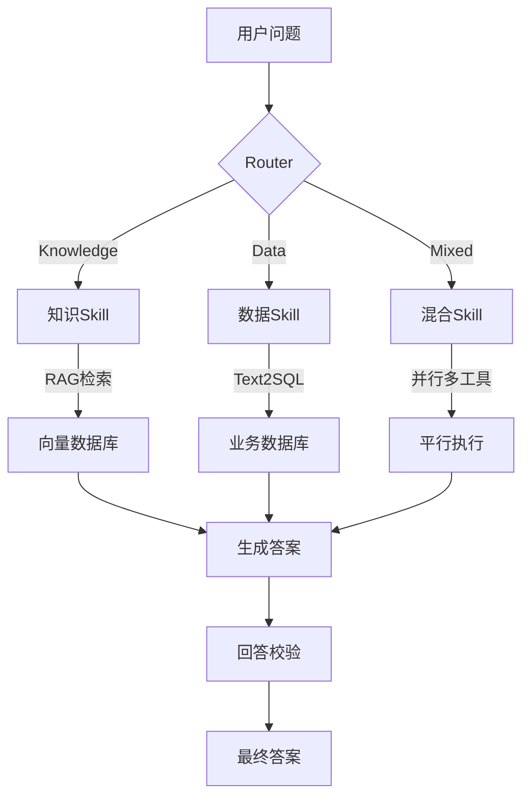
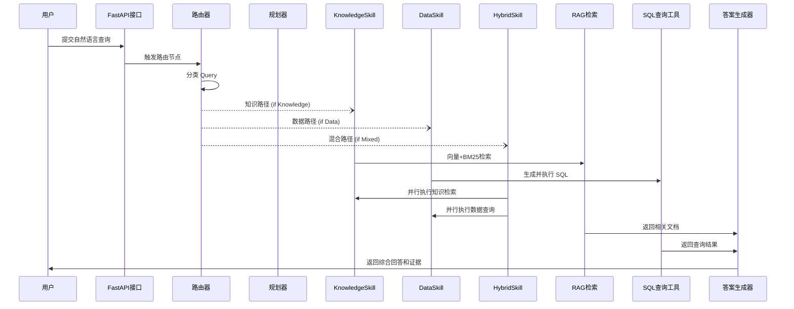
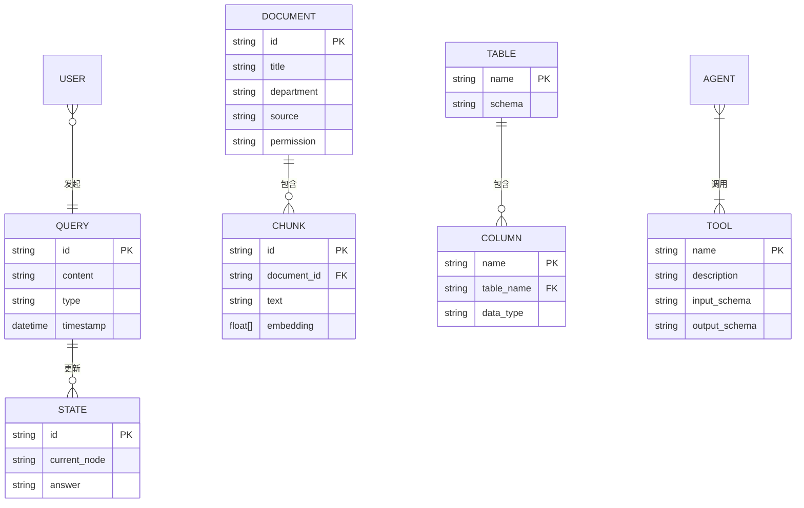

# 执行摘要

面向企业级场景，本方案提出一个**基于 LangGraph 的智能 Agent 平台**，同时处理知识问答、经营数据分析与库存风险诊断三类任务。系统通过路由器（Router）将用户查询自动分类为知识型、数据型或混合型，由对应的技能（Skill）链路完成检索、计算和推理，并通过 LangGraph 进行流程编排与状态管理。使用混合检索（Dense+BM25）提升问答质量，Text2SQL 技术查询业务数据库，结合业务规则计算库存风险。平台采用 MCP 规范接入工具，提供 FastAPI HTTP 接口，并注重**可追溯性**（上下文状态、证据收集）、**权限安全**（文档/数据访问控制、SQL 校验）和**工程化**（日志/Trace/SSE、指标监控、离线评测）等特性。本文深入分析需求，提供功能设计建议、接口示例和技术选型对比，并对比了现有开源项目 [Enterprise-Decision-Agent](https://github.com/ccy777/Enterprise-Decision-Agent) 的架构与实现差异。

## 项目目标与范围

本项目旨在构建一个**企业智能决策 Agent 平台**，覆盖以下三类用户需求：  

- **Knowledge**（知识问答）：回答与企业内部文档、制度、产品手册等**非结构化知识库**相关的问题。采用检索增强生成（RAG）技术，结合向量检索和BM25检索，从知识库中找出相关信息并生成答案。  
- **Data**（经营数据分析）：回答与企业业务数据相关的问题，如销售报表、财务、库存等。采用**Text2SQL**和自动分析，将自然语言问题转为 SQL 查询业务数据库，并基于查询结果生成报告式答案。  
- **Mixed**（混合场景）：回答需要同时结合知识文档与业务数据的问题，例如“根据销售政策筛选满足条件的客户”或“结合库存制度分析积压风险”。此类任务需要**多工具协同**（同时调用知识检索与 SQL 查询），再进行综合推理。  

系统采用**Skill 架构**：每类任务对应一个或多个 Skill 模块（如 KnowledgeSkill、DataSkill、InventoryRiskSkill），它们封装具体能力。LangGraph 作为流程编排引擎，将用户请求变为有状态的多步工作流，利用节点（Node）和边（Edge）定义执行步骤。整个服务通过**FastAPI**提供 HTTP 接口，接收请求并返回答案。平台使用 **Model Context Protocol (MCP)** 标准规范接入工具，使得内部 Skill 可作为 MCP 工具被调用，同时也能调用外部 MCP 工具（例如企业内部 API）。  

简言之，本项目建立一个**多任务、多工具**的企业 AI Agent 平台，核心结构如图所示：  



## 关键功能需求

- **Router（查询分类）**：使用一个独立的节点（LangGraph Node）分析用户输入，将查询归类为 **知识型/数据型/混合型**。可以基于预设规则或调用 LLM 分类（Prompt 提供指令分类）。例如使用 `Command(goto="KnowledgeSkill")` 跳转到知识问答流程。**单代理 vs 并行**：Knowledge 和 Data 由单一技能完成，Mixed 可以并行 Fan-out 调用知识和数据技能（LangGraph `Send` 模式）。  

- **Planner（规划器）**：对于混合型问题，需要分解多步骤执行计划（Task Planning）。Planner 节点可生成明确的执行计划，例如 `{ "step1": "检索知识", "step2": "执行 SQL", "step3": "综合推理" }`。通过 LangGraph 状态保存计划后续执行。示例：  

  ```python
  def plan_mixed_task(state: State) -> dict:
      query = state["query"]
      # 分析需求，规划执行步骤
      # 示例: 如果问题同时包含"库存"和"销售"，则并行知识和数据
      plan = {
        "skills": ["KnowledgeSkill", "DataSkill"],
        "combine": "parallel"
      }
      return plan
  ```

- **Skill 列表与职责**：  
  - **KnowledgeSkill**：负责知识检索问答。包括文档加载、向量检索、BM25检索、结果融合（如所述混合检索）和生成回答。  
  - **DataSkill**：负责业务数据查询和分析。利用 Text2SQL 将自然语言转成 SQL。调用安全 SQL 工具（见后文），执行查询，处理结果（必要时调用数学/统计工具）。  
  - **InventoryRiskSkill**：专门针对库存风险问题。功能包括：查询库存和销售数据表，计算**库存风险系数**（=（当前库存+在途库存）÷未来三月预测需求），结合 ABC 分类和周转率计算风险等级。返回风险诊断报告（风险等级、主要原因、建议）。此技能会调用 DataSkill 的查询工具，并可检索相关制度文档辅助判断。  
  - (可扩展) **其他Skill**：例如**报销政策Skill**、**客户分析Skill**等，可按需新增。  

- **Hybrid RAG 细化**：知识检索时引入混合检索策略。具体做法：首先使用向量搜索（如BGE、LLaMA2 embeddings等）取得前K文档，再用 BM25 检索拉回来补充，最后用**加权融合/Reciprocal Rank Fusion (RRF)** 合并结果。示例方案：使用 LangChain 的 `EnsembleRetriever` ，将多个 Retriever 赋予权重。如：

  ```python
  dense = vectorstore.as_retriever(search_kwargs={"k": 5})
  sparse = BM25Retriever.from_documents(chunks)
  hybrid = EnsembleRetriever(retrievers=[dense, sparse], weights=[0.7, 0.3])
  results = hybrid.invoke(state["query"])
  ```
  
  返回的文档再经过交叉编码器排序（Cross-Encoder rerank）选取TopN，以提高相关性。

- **Data Skill / Text2SQL**：按照 LangChain SQL Agent 指南，实现以下步骤：  
  1. **获取表/字段**：通过工具如 `get_enterprise_schema()` 获得数据库中允许查询的表和列信息（对应 PolicyLayer 工具）。  
  2. **相关表识别**：LLM根据问题判断所需表，或使用工具查询表名。  
  3. **生成 SQL**：根据问题和表结构，让 LLM 生成 SQL 语句。  
  4. **校验 SQL**：使用另一个工具如 `sql_db_query_checker` 检查语法和安全性，如确保只含 SELECT、没有危险操作。可参考 PolicyLayer “execute_safe_query”说明。  
  5. **执行 SQL**：调用 `execute_safe_query(sql)`（内部接SQLGuard）查询数据库并获取结果。  
  6. **后处理**：将返回的表格结果转换为文本或结构化数据，并让 LLM 根据需要生成解释文本（例如同比增长率等）。  

  接口示例（FastAPI 工具）：
  ```python
  @tool
  def execute_safe_query(query: str) -> str:
      """执行经过校验的只读SQL查询，返回JSON格式结果。"""
      safe_sql = sql_guard(query)  # 内部检查安全
      rows = database.execute(safe_sql)
      return json.dumps(rows)
  ```

- **Evidence Builder（证据整理）**：答案生成后收集并格式化证据。对于知识问答，将返回的文档元数据（标题、来源、段落位置）作为引用；对于数据查询，在答案中附上源表、执行时间、SQL语句等信息（可参照下文回答可追溯性章节）。例如回答部分附注：  
  > “根据**《销售政策手册》**第5条及 `sales_orders` 表查询，2025年华东区销售额最高的客户是XXX……”  

- **Answer Review（答案审查）**：对最终生成的答案进行质量检查和约束。可以设计一个规则或模型评价器节点检查：答案长度、格式、逻辑一致性、是否包含自相矛盾等。如发现不符合需求，可触发重新生成（LangGraph 支持条件跳转重试）。例如：如果生成答案中未包含“来源”，则重跑循环加上来源部分。  

总体来说，关键功能按流程组织：**Router → Planner → 调用对应 Skill → 工具执行 → 证据收集 → 回答生成 → 回答校验**。LangGraph 的工作流节点可以表示上述每一步，状态 (state) 在节点间传递和更新，各节点均可存取及修改上下文信息。

## 上下文与状态管理设计

系统需要维护复杂的上下文（状态），以支持多轮对话和分布式任务执行。建议设计如下状态（State）结构（示例 Python TypedDict）：

```python
class AgentState(TypedDict):
    query: str                 # 用户当前问题
    query_type: str            # 分类结果: "Knowledge"/"Data"/"Mixed"
    plan: dict                 # 如{"steps": [...], "skills": [...], ...}
    documents: list            # RAG 检索到的相关文档
    sql: str                   # 生成的SQL语句
    sql_result: list           # SQL 查询返回的结果行
    inventory_data: dict       # 库存相关的中间数据
    answer: str                # 最终文本答案
    citations: list            # 引用/证据列表
    error: str                 # 错误信息（若有）
```

- **短期记忆 (短期上下文)**：使用 LangGraph 内置的线程（thread）范围内状态持久化。用户在一个会话线程中的多轮对话，共享同一个 `AgentState` 对象，保存历史消息、已检索文档、上一步计划等。LangGraph 会话通过检查点（checkpointer）机制在数据库（如Mongo、Redis等）中持久化状态。这样可以暂停后恢复或跨服务器并发执行。  
- **长期记忆 (长期存储)**：对于跨会话或全局信息，可使用 LangGraph Stores（持久性存储）来保存用户档案或重要事实。例如保存客户资料、公司常识等，与特定会话无关的信息可以存入向量数据库或其它存储方案备查。  
- **对话线程管理**：每个用户会话对应一个 thread ID，短期状态隔离于每个会话。支持同一用户开启多任务并行的多线程。LangGraph 的 StateGraph 会确保不同线程状态不混淆。  
- **并发与恢复**：由于 LangGraph 支持异步和并行节点（如 `Send` fan-out），需要考虑并发安全。状态对象设计时，避免竞态：可以为每个并发分支保存子状态，最终聚合结果。若系统中断，可根据持久化的状态恢复 Agent 到中断处继续执行。  
- **示例**：QueryAnalyzer 节点将 `state["query_type"]` 设置为 “Data”，然后 DataSkill 节点使用该状态执行 SQL 工具，结果写入 `state["sql_result"]`。在每个节点执行前后，LangGraph 会自动保存最新状态。因此后续节点可以读取和使用这些信息。  

## 工程化需求

构建企业级系统需要完善的监控、日志和性能目标：

- **Trace / 可观测性**：每次请求在系统内部的执行链路需要全程追踪（trace）。可使用 LangSmith 等监控工具。实现方式包括：每个 LangGraph 节点的输入输出、工具调用、LLM 调用都记录为一个“span”，形成可视化的调用树；异常和性能数据（耗时、Token 消耗等）记录到监控系统。LangSmith 提供“全量追踪、性能监控、评估”等功能；可记录每次模型调用花费的时间和 Token，分析瓶颈。  
- **日志**：针对关键步骤和工具调用，记录可审计日志。至少记录用户ID、会话ID、提问内容、所调用工具和其输入输出，以及最终答案和来源。错误日志需详细。日志格式结构化，方便检索和分析。  
- **SSE/流式输出**：为了提升用户体验，建议支持 Server-Sent Events（SSE）或 WebSocket 实时推送中间结果。比如逐段流式输出 LLM 生成的答案，同时报告当前执行进度（“正在执行 SQL 查询”、“完成知识检索”等）。FastAPI 可通过 `yield` 实现流式响应。  
- **性能/延迟目标**：根据企业需求，设定可接受的延迟与吞吐。例如：95%请求响应时间 <3秒，Token生成首响应 <1秒。整体并发支持至少数十 QPS（请求/秒）。对于 RAG 模型推理，可使用并行 GPU 或批量处理以降低延迟。数据库查询需考虑限制用户输入规模。  
- **监控指标**：参考“六大信号”：**调用次数**、**Token总耗用**、**延迟**、**错误率**、**工具调用次数**（各工具的 QPS）和**回答质量（人工评测）**。实时监控这些指标，发现异常（如检索命中率下降、工具调用频繁失败等）。对话长度和内存增长也应监控。可使用 Prometheus/Grafana 等方案，可自定义创建如“路由准确率”、“检索命中率”、“SQL 执行成功率”等指标。  

## 安全与权限

企业应用必须严格的数据和功能权限控制：

- **文档/知识库权限**：知识库中的文档需带有部门/角色权限标签。检索时需根据用户身份预先过滤文档。例如：`state["user_role"]="财务"`，则 RAG 检索仅在部门为“财务”或公开的文档中查询。实现上可以在向量数据库查询时加上元数据过滤（Chroma/Weaviate等均支持带过滤条件检索）。避免先检索所有再过滤的低效方式。  
- **数据访问权限**：对数据库查询使用细粒度访问控制。仅授予 AI Agent 一个受限账号，只能执行SELECT，并仅对必要表有权限。不同角色用户若有差异，可在 Agent 端校验：如普通员工只能查询自己相关部门，管理者可查询全局。结合 FastAPI 登录认证（如 OAuth2/JWT），前端提交的用户信息决定 Agent 状态中的权限字段。  
- **SQL 安全策略**：所有模型生成的 SQL 必须通过安全检查。实现 `execute_safe_query` 工具内部仅允许读操作，且自动在SQL前加上 `LIMIT` 等防护。也可使用 SQLGuard 服务对语句 AST 进行校验。禁止任何 DROP/INSERT/UPDATE 操作。可以设置每会话最大查询次数/频率，防止滥用。错误必须捕获并返回友好提示，避免泄露数据库信息。  
- **审计与合规**：记录所有用户提问及 Agent 行为日志（查询内容、调用工具、SQL 语句、返回结果）。将运行时对话与操作记录下来，以便事后审计。对于敏感数据检索，可对结果进行模糊化输出或需要审批后才能提供。确保遵循企业安全规范（如 GDPR/ISO27001）对数据处理进行加密、访问认证等保护。  

## MCP 与工具接入规范

使用 **Model Context Protocol (MCP)** 标准统一工具接口，便于描述和治理工具：

- **接口契约**：每个工具（Tool）需有清晰的名称、功能描述、输入输出规范。例如：  
  ```python
  @tool
  def get_enterprise_schema() -> str:
      """获取数据库中所有授权表及字段的元数据信息。"""
      # 实际返回可以是JSON字符串或格式化的文本
  ```
  MCP 要求工具必须声明参数类型和返回类型（可以使用 Pydantic 模型）。工具描述应简洁明确，如“execute_safe_query: 执行只读SQL并返回结果”。这些元信息将被注册到 MCP 目录，供其他服务调用。LangGraph Agent Server 支持自动将节点注册为 MCP 工具。  
- **工具能力描述**：建议维护一个工具列表，包含能力说明。例如：

  | 工具名称             | 描述                          | 输入                   | 输出           |
  |:-------------------:|:----------------------------:|:---------------------:|:-------------:|
  | `search_knowledge`  | 知识库检索                     | 查询文本 (string)     | 文本摘要或相关文档列表 |
  | `execute_safe_query`| 执行校验后的 SQL 查询（只读）   | SQL字符串             | JSON格式的查询结果 |
  | `calculate`        | 计算表达式                     | 算术表达式 (string)    | 结果 (string) |
  | `current_time`     | 获取当前时间                   | 无                    | 时间戳 (string) |
  | `get_business_definitions` | 获取业务定义词汇          | 无                    | 定义列表 (string) |
  
  这些工具可本地实现，也可通过调用外部服务。所有工具应有超时和错误处理逻辑，返回格式统一（如 JSON 结构包含 `success` 标志和 `error` 信息）。  
- **错误/超时处理**：每个工具应限制执行时间，并捕获异常返回错误码和信息，避免阻塞 Agent。LangGraph 支持节点的重试策略，当工具调用失败时，可在 WorkFlow 中自动重试（如 RAG 检索失败重试一次）。错误应记录到日志和状态。  
- **版本管理**：工具如果更新接口或模型，应通过版本号管理。MCP/Agent Server 可通过工具名称、版本来区分不同实现。确保兼容旧流程，可在描述中注明兼容性。  

## 离线评测与指标

为保证 Agent 效果，需建立离线评测体系：

- **评测数据集设计**：构建包含各类型问题的测试集。每条记录包含：`question` (文本)、`category` (Knowledge/Data/Mixed)、`expected_answer` (参考答案)、`expected_evidence` (正确文档/SQL 片段)、`expected_tool_usage` (应调用哪些工具)等。测试集需覆盖常见场景（如政策问答、数据查询、混合业务情景）。可模拟实际用户对话和问题，结合人工生成答案，保证高质量。  
- **路由准确率**：评估路由器对问题分类的正确率（Knowledge/Data/Mixed）。按比例统计分类错误率，指导优化分类策略或Prompt。  
- **检索命中率**：对于知识问题，统计向量+BM25检索命中（相关文档是否在TopK列表中）。使用标准信息检索指标，如Recall@K。  
- **工具调用正确率**：监测 SQL、知识检索等工具的调用成功率。例如，要求生成SQL能正确执行并返回合理结果的比例；期望检索结果与参考答案是否匹配。  
- **答案与证据质量评估**：对生成的答案进行自动和人工评价。可使用准确率、F1、BLEU等指标比对参考答案。此外，检查答案中引用的证据是否正确（如引用的文档是否与问题相关）。通过人工评审标注答错案例，计算答错率（accuracy）和偏差。  
- **持续评估**：定期将生产环境对话样本纳入评测，检查模型漂移。采用在线评估（结合的思想）和离线回放，形成“回路”，不断更新评测集。

## 数据与存储需求

- **知识库格式**：支持多种文档格式（PDF、Word、Markdown、TXT、网页等）批量导入。每个文档需保留元数据（标题、部门、版本、权限、来源等），示例字段：`{id, title, department, version, source, permission_roles}`。导入流程：文件→分段（Chunk）→去噪（去掉水印/模板）→嵌入（生成向量）→存入向量库。切分粒度需平衡上下文完整性与检索性能。推荐使用带重叠(chunk overlap)的分段策略。示例元数据 JSON：  
  ```json
  {
    "doc_id": "doc001",
    "title": "员工差旅制度",
    "department": "HR",
    "version": "v1.3",
    "source": "travel_policy.pdf",
    "permission": ["HR", "经理"]
  }
  ```  
- **向量库选型**：常用选项包括 Chroma、Weaviate、Pinecone 等。下表为对比：

  | 向量库       | 优点                          | 缺点                              |
  |------------|-----------------------------|--------------------------------|
  | ChromaDB   | 开源轻量，集成简单；**嵌入式**模式（SQLite+内存索引），**易部署**。适合原型和中小规模。 | **单机内存存储**，高并发下锁竞争；数据量大时查询或插入性能降低。需要定期持久化备份。 |
  | Weaviate   | 开源分布式，可水平扩展；内置多种模块（向量、BM25、本体）；支持GraphQL查询，可多模态检索。 | 部署复杂、运维成本高；硬件需求较高；社区相对Chroma小。 |
  | Pinecone   | 全托管服务，弹性可扩展；高性能、低延迟，自动分片；支持降维等高级功能。 | 商业付费，长期成本可观；依赖外部服务，存在数据安全/隐私考虑。 |
  
  *(参考：Chroma适合开发者快速原型，Milvus/Weaviate面向企业级部署)*

- **数据库接入**：业务数据如员工、订单、库存等表需接入关系型数据库（如MySQL、PostgreSQL、SQLServer等），由 `execute_safe_query` 工具访问。应配置只读账号。可考虑使用连接池（asyncpg、SQLAlchemy等）提高并发效率。敏感表可考虑物化视图或中间层对外暴露简化接口。  
- **元数据存储**：向量库需存储检索相关元数据（文档ID、分段位置等）并允许检索时过滤。分段表可以存在 SQL/NoSQL 数据库中或向量库自带的文档存储。对话和状态可使用持久化后端（MongoDB、Redis等），如 LangGraph Checkpointer 默认支持 Redis/Mongo。  
- **备份策略**：知识库中的原始文档和向量库需定期备份。向量库如Chroma使用PersistentClient可直接备份存储文件；数据库备份可以使用主从复制或定期导出。备份方案需保证在系统故障或数据损坏时可迅速恢复。  

## 系统架构草图与工作流

以下为主要流程和实体关系示意图：





## 实施路线图与里程碑

建议分阶段交付，以快速迭代验证和风险控制：

1. **阶段 1 (MVP)**：  
   - 实现**知识问答**和**数据查询**功能的基础版本：完成知识库文档导入及向量化，搭建向量数据库，简单构建 RAG 问答流程；完成数据表连接与 Text2SQL 转换的基本Agent，并返回查询结果。  
   - 架构搭建：用 LangGraph 实现路由和基本流程，FastAPI 接口支撑调用。  
   - **交付**：支持查询企业文档（PDF/Markdown）问答，支持执行用户指定的简单SELECT查询。提供示例API文档。  

2. **阶段 2**：  
   - 引入**混合检索**（Dense+BM25）和**结果排序**功能，优化知识问答效果。  
   - 完善**安全与权限**：实现文档检索权限过滤、SQL 语句校验（只读、超时等）。  
   - 增加**证据追溯**：答案附带文档ID/页码或SQL详情等来源信息。  
   - **交付**：功能稳定版本，知识+数据查询路径可靠，支持简单多轮问答（对话历史记忆）。  

3. **阶段 3**：  
   - 增加**Inventory Risk Skill**：实现库存风险诊断流程。数据Skill提取库存与销售数据，应用风险系数算法。  
   - 增强**规划器与多任务执行**：支持混合查询的并行执行与合并回答，提升效率。  
   - 引入**问答审校和重试**：若答案校验失败，能自动重新调用工具/模型。  
   - **监控埋点**：接入 LangSmith/Prometheus 监控，记录关键指标（响应时间、错误率、工具调用等）。  
   - **交付**：功能齐全的试运行版本，包括库存风险分析模块，多轮对话支持，日志监控系统搭建。  

4. **阶段 4 (上线准备)**：  
   - **负载测试与优化**：压力测试并优化延迟瓶颈，调整模型并行度或扩容基础设施。  
   - **离线评测**：构建并运行离线测试集，验证路由准确率、检索/工具调用命中率和答案质量，修正问题。  
   - **安全审核与优化**：根据企业合规要求进一步强化审计日志与权限控制。  
   - **发布上线**：准备生产环境部署（容器化、CI/CD流水线、备份策略）。  

每阶段结束时进行**里程碑评审**，确认功能达标再推进。此路线图确保逐步验证关键组件，并在每个阶段都可用结果验证收益。

## 风险与缓解措施

- **模型生成不准确/幻觉**：LMM 有时会“编造”回答。缓解方法：采用 RAG 限制模型输入信息来源，并对重要回答进行工具/规则校验。增强 **Answer Review** 阶段，确保关键事实可查证。  
- **工具或数据库调用失败**：SQL执行错误或查询超时等。缓解：增加重试机制和后备策略（如改写提示、缩小查询范围），必要时反馈用户无法完成请求的信息。  
- **权限/安全泄露**：不当的权限配置可能泄露敏感数据。缓解：默认封闭权限，仅开放必要接口。引入安全审计，对每次工具调用进行检测（如PolicyLayer所示）。  
- **性能瓶颈**：大量并发或知识库增长可能导致检索慢。缓解：采用分布式向量库(如Milvus)、缓存热点文档、优化索引。对LLM推理进行批量并行、限流、异步处理。  
- **对话上下文丢失**：长对话可能超过模型上下文长度。缓解：使用对话摘要/剪枝技术，只保留相关历史；或将重要历史写入短期记忆并智能提取。  
- **评测覆盖不足**：离线数据集可能无法覆盖所有生产情况。缓解：持续收集真实用户对话案例，扩大测试集。上线后配置反馈渠道（用户评价、人工抽检）。  
- **开发/部署复杂度**：多组件系统易集成出错。缓解：模块化开发、充分单元测试、明确接口合同。使用容器化和自动化运维工具降低部署难度。  

## 与 “Enterprise-Decision-Agent” 项目的对比分析

[Enterprise-Decision-Agent](https://github.com/ccy777/Enterprise-Decision-Agent) 是一个现有的示例实现（作者：ccy777），其主要特点和我们的设计对比如下：

- **架构定位**：原项目显式支持 MCP 服务，其 **工具定义** 包含 `get_business_definitions`、`get_enterprise_schema`、`execute_safe_query` 等。这些工具主要面向“查询企业定义”和执行“安全的只读SQL”。由此可见，其主要聚焦于数据接入层的实现（尤其数据库层面的安全查询），并未提及知识检索的细节。我们的设计在此基础上**补全知识问答**（Hybrid RAG）、**库存风险分析**等业务流程，并明确了路由与技能分工。我们可以复用他们的工具实现（如安全 SQL 工具），并将其集成到 LangGraph 流程中。  
- **功能覆盖**：Enterprise-Decision-Agent 已实现**DataSkill**中所需的一部分工具（安全查询与模式获取），但**缺少 KnowledgeSkill**和**混合任务**相关实现。我们计划新增混合检索与 LLMapI 问答功能。这意味着在 Knowledge 方面，可能需额外实现文档解析、向量存储与检索流程。对于 InventoryRiskSkill，原项目没有提及，我们需全新开发这一业务逻辑。  
- **LangGraph 编排**：原项目作为 MCP Server，可能未使用 LangGraph 的流程编排；若有使用，也未公开详细文档。我们的方案将**明确用 LangGraph 定义 Router、Planner、各 Skill**，突出其有状态、多节点协作的价值。即在架构层面更强调状态管理与多步骤工作流。  
- **Tool 调用**：二者都采用 MCP 工具调用机制。我们可以借鉴其工具设计（名称、描述、安全策略），并在接口示例中标注直接来源。例如 `get_enterprise_schema` 在原项目和我们方案中描述一致。不同之处是，我们的工具列表更丰富（如知识检索、计算、时间处理等），并添加了工具调用后的后处理逻辑。  
- **FastAPI 接口**：未见原项目公开，但题目说明用FastAPI，我们将设计统一的 `/query` 等端点暴露 Agent 服务。考虑到可插拔性，我们可能也支持将每个 Skill 单独作为MCP工具暴露。  
- **差距与可复用模块**：原项目提供了**SQL安全**和**企业模式**相关的实现，值得复用；我们的设计重点则在**RAG检索**、**多技能融合**、**内存管理**等方面进行扩展。InventoryRiskSkill 是新增的业务逻辑。原项目若有用户权限或日志模块，也可参考其实现方式。  

总之，我们的方案以 **LangGraph 全流程编排**为核心，将 Enterprise-Decision-Agent 的数据工具抽象为 Skill 组件，并扩展为一个更完整的企业智能分析平台。在最终报告和交付时，可在**“差异说明”**中标注哪些设计借鉴自 [ccy777/Enterprise-Decision-Agent]（如安全 SQL Tool、业务定义查询等）以及我们新增或改进的功能模块。  

### 主要参考

- LangChain 官方文档（LangGraph、Router、SQL Agent、Memory）  
- 混合检索理论与实践  
- 企业库存风险分析方法  
- MCP 工具框架与安全策略  
- LangSmith 监控与评估  

以上为针对“基于 LangGraph 的企业级 AI Agent 平台（知识问答、经营数据分析、库存风险诊断）”的深度需求分析报告。